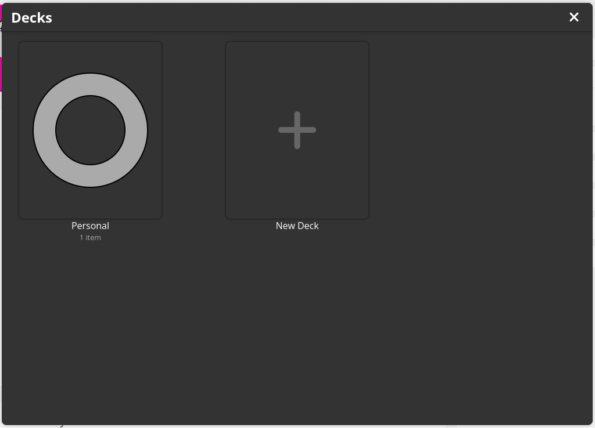
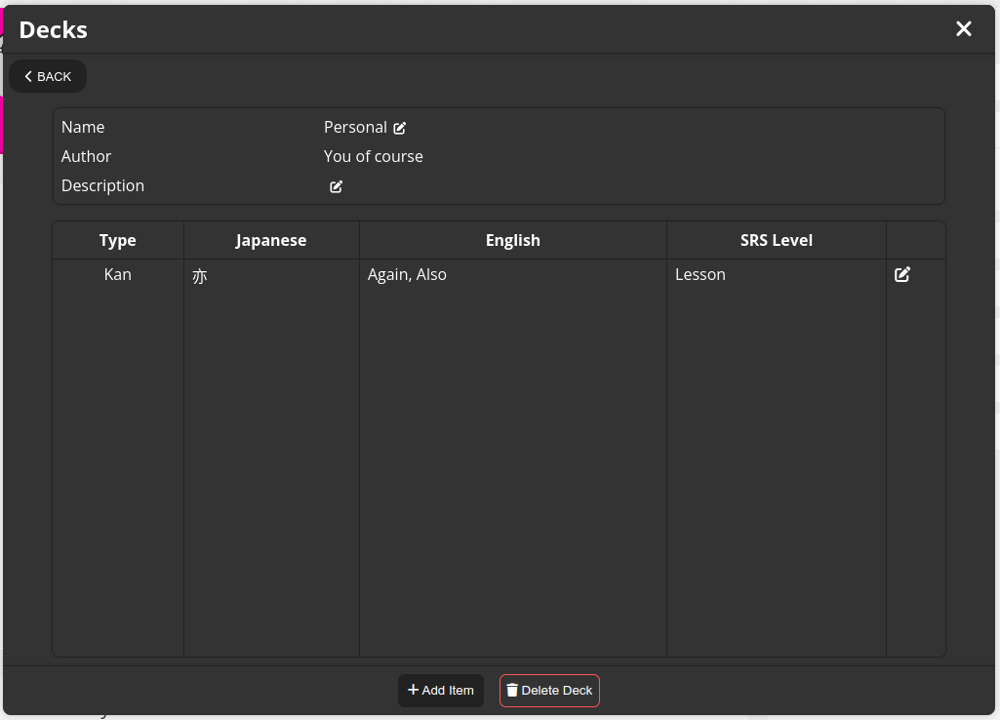

# WICS

WICS (WaniKani Integrated Custom SRS) is an extension that allows you to add
your own custom content into [WaniKani](https://wanikani.com)'s SRS system.

# How it works

WICS hijacks the requests made by WaniKani and appends your own custom items to
it. This way the experience is seamless, and you don't need to use a separate
site or SRS system to do your reviews. The extension also keeps track of all of
the level up information, so the custom reviews come at the same expected pace
the originals come in.

# Installation

There are two methods of installing WICS.

- You can install it from the Chrome Webstore or the Firefox Add-ons page
  (Coming soon!)

- You can build the extension from source (instruction below), and load it as an
  unpacked extension (requires developer mode to be turned on)

# Usage

After installing the extension, clicking on the icon in the extension panel
opens a popup with the possible navigation options. At the time these are the
options:

- Manage Decks: lets you create, delete and edit decks and their corresponding
  items
- Options: lets you customize the functionality of the extension

### Deck Management

Opening the deck management page shows the following:

This will be completely empty on your first time over. You can either create a
deck or, if you have one, edit it by clicking on it.

Editing a deck presents you with this page:

The deck information is editable, you can add items, delete the deck, or, by
clicking on an existing one, edit an item.

When creating an item, there are certain required fields, that need to be filled
out in order to proceed. You will be notified of it, if you miss any. Most
fields however are entirely optional.

Editing an item (for now) only shows the information you've already inputted
when creating that item.

### Lessons and Reviews

After adding an item, it will be on the "Lesson" level. This means, that when
you do lessons, this item will eventually come up. After passing the lesson
level, the item will be available for review [with the same intervals, WaniKani
uses](https://knowledge.wanikani.com/wanikani/srs-stages/#what-are-actual-srs-timings).

For now there is no requirement to pass a specific item, before another one
unlocks, but this will change later on.

By default, custom lessons are placed at the end of your lesson queue, and
reviews are placed randomly, but this can be changed in the options.

### Options

All options have a help text, that tells you what that setting is meant to do.
If you find their name confusing, it's probably because explaining it better
would have taken a paragraph and that's exactly what the help text is. This
help text can be brought up by hovering over the question mark icon next to the
name of the option.

# Building from source

The extension uses [vite](https://vitejs.dev/) as its backbone. To build the
extension for installation, run `vite build`. If everything went well, you can
install the generated `dist` folder as an extension, and you should be ready to
use WICS.

If you want to develop the extension, running `npm run dev` will open a browser
window, free from your usual config, but with the extension already installed.
It also reloads your extension automatically when you make changes.

# Contribution and Issue Policy

Please report any issue you find (if it's already known, feel free to drop
another example into the issue, it's never bad to have more proof).

I accept contributions of any size, from typo fixes to complete rewrites, but I
have strict style guides that contributions need to follow in order to get
merged.

The project is written in [TypeScript](https://eslint.org/) formatted using
[Prettier](https://prettier.io/) and linted using [ESLint](https://eslint.org/).
Errors should only be ignored when necessary.

# Roadmap

The project is currently in Alpha. This means that there are bugs and a ton of
odd behaviour that needs to be fixed. Currently the plan on moving forward is
as follows:

### High Priority

- Support more WaniKani item fields
  - This includes sentences for vocab, radical and kanji composition, related
    vocabulary and kanji, and so on
  - This most likely also includes custom meaning and reading notes
- Make decks shareable
  - The whole point of the extension is that you should be able to export your
    custom made deck and share it with others. This could make it useful for
    book clubs and make stuff like Math decks a thing.
- Use the API of [Jotoba](https://jotoba.de/) and [KanjiAPI](https://kanjiapi.dev/)
  to autofill certain fields during item creation.
  - This would make creating
    items much less tedious.

### Low Priority

- Export to anki
  - Sort of defeats the point of the extension, but a nice to have if you want
    to pivot to a different application.
- [Yomichan](https://foosoft.net/projects/yomichan/) integration
  - Mining vocabulary would be much easier this way
- A website for publishing and sharing decks similar to
  [Ankiweb](https://ankiweb.net/decks/)
